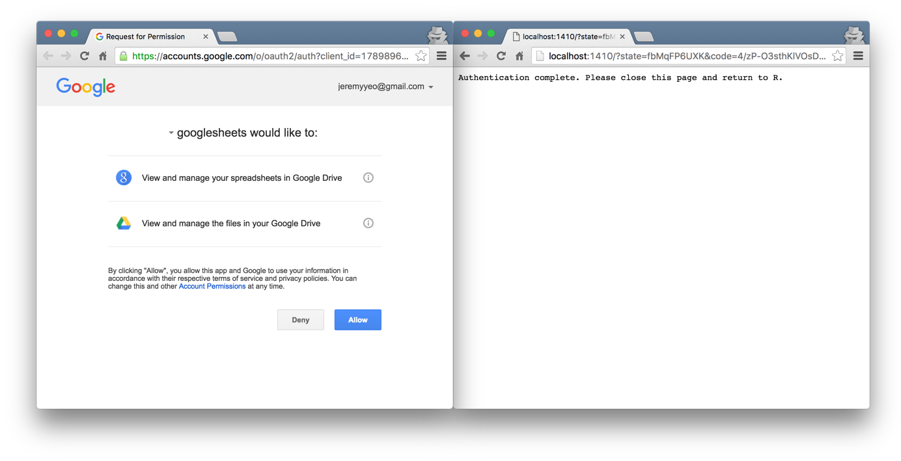

```{r setup, include=FALSE}
knitr::opts_chunk$set(echo = TRUE)
```

You might find yourself occasionally wanting to work with Google Sheets within R. Here is how you can do that thanks to the `googlesheets` package.

```{r}
# install.packages("googlesheets")
require(googlesheets)
```

# Authenticating

The googlesheets package comes with a preset client ID and secret but I find it best to set one up yourself so that your access does not get rate limited due to everyone else sharing the same credentials. You can generate one in the Google Developers Console: https://console.developers.google.com/

There is currently an issue with authenticating with your own credentials so the example below will use the credentials supplied with the package.

```{r, eval=FALSE}
# clientID <- "insert your own client id here"
# clientSecret <- "insert your own client secret here"
# token <- gs_auth(new_user = TRUE, key = clientID, secret = clientSecret, cache=FALSE)
sheets_token <- gs_auth(new_user = TRUE, cache = FALSE) # this should open up a browser.
```



Optionally, save your token into a file so we do not have to do the browser dance every time you want to access Google Sheets from R:
```{r, eval=FALSE}
save(sheets_token, file = "sheets_token")
```

To reauth the next time around, just do:
```{r, eval=FALSE}
load("sheets_token")
gs_auth(sheets_token)
```

# Sheet Access

I'm too lazy to write a demo now so you'd just have to make do with the excellent readme on the googlesheets repo:

https://github.com/jennybc/googlesheets
